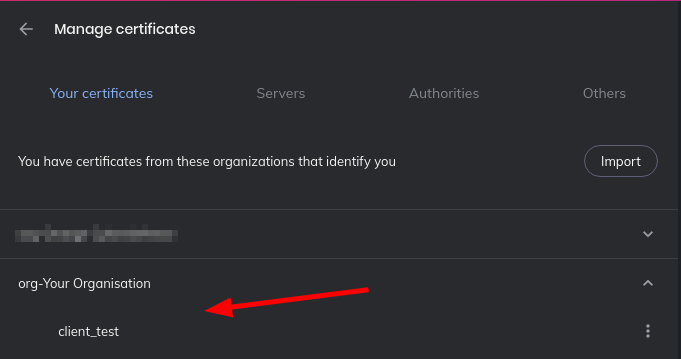
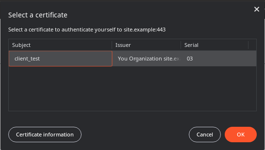
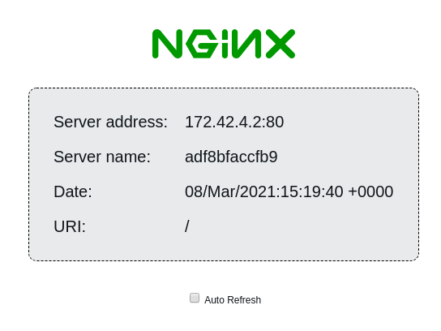

# Authenticating reverse proxy on docker using client certificate authentication

## What is Reverse Proxy Auth
**Nginx** can easily be configured to act as a **reverse proxy** in order to externaly expose on the same point different web services hosted internaly.

To restrict the access to the content hosted behind the proxy, it is possible to require the users to provide a **personal certificate**. Using this mechanism, you ensure only **trusted users are allowed** to access protected services.

This project provides all the tools needed to easily setup and configure the reverse proxy and the client certificates.

## 1. Preparation
This project requires Docker and Docker-compose to be installed.   
The docker-compose.yml file describes the architecture of the project.
Alternatively, you can use the provided files on a regular Nginx server to use the same mechanism without Docker.

**Files:**
The `nginx/nginx.conf` file is configured to run Nginx using default configuration.

The `nginx/fastcgi.conf` file is the default configuration for FastCGI.

The `nginx/proxy.conf` file contains the parameters to optimize the proxy role of Nginx.

The `nginx/ssl.conf` file is configured to use strong encryption protocols and ciphers. It also add security mechanisms through headers.

The `nginx/conf.d/site.example.conf` is configured to listen on ports **80** and **443** and requires clients to use a certificate to authenticate themself. If a client is successfully authenticated, it is redirected to the webapp docker machine.

#### Architecture:
client [certificate] -> front [CA + proxy] -> webapp [website]

### 1.1 Server initialization
- Go to `nginx/ssl` : `$ cd nginx/ssl`
- Edit the `ca/ca.cnf` file to reflect your organization values in the `[ ca_dn ]` part.
  - Create the certificate authority (CA): `$ ./create_ca.sh`. The file `create_ca.sh` should then by set to mode 000 in order to avoid erasing the issued CA.
- Edit the `tls/tls.tpl` file to reflect your organization subdomain values in the `[ default ]` part.
  - Create a certificate for the front website `$ ./create_tls.sh site.example`. The DNS name of the website can differ but you have to edit the file generated in `nginx/conf.d` to match the actual name.
 Alternatively, you can buy a certificate from a recognized issuer or get one for free using Let's Encrypt.
- Edit the `client/client.tpl` file to reflect organization values in the `[ client_dn ]` part. You don't need to change the email address, this will be done by the script.
  - Create a client `$ ./create_client.sh firstname lastname client@site.example`
The newly created certificate is located in `clients/p12` and protected by a password added to the `clients/passwords.txt` file.   

- Go to `nginx/conf.d` : `$ cd ../conf.d`
- Open the `site.example.conf` to adjust the following parameters :
  - Change the `site.example` value after `server_name` to match your website's URL (2 times).
  - Change the values after `ssl_certificate` and `ssl_certificate_key` to match your website's certificate.
  - Change the `http://protectedapp;` value after `proxy_pass` to match your docker application's name or its address (domain name or IP).
  - **Optional**: change the log's name after `access_log`.
- **Optional**: change the file's name, as long as its extension is ".conf".

### 1.2 Client side initialization
In your browser, to go the *settings* -> *certificate* part. It can have different names, such as "manage certificates" or "view certificates".   

This part has 4 sections: "Your certificates", "People", "Servers" and "Authorities".   

In the "Your certificates", click "import" and select the .p12 file issued for you. The browser asks for a password which has been assigned during the certificate creation.

**Optional**: In the "Authorities", import the "ca.crt" certificate. Check "Trust this CA to identify websites". You don't have to do this if your website certificate has been issued by a recognized issuer.

Then, validate/exit the certificate manager part.

### 1.3 Testing the service
- In the root directory, where the "docker-compose.yml" is located, run `$ docker-compose up`.   
- Edit the `/etc/hosts` file using sudo `$ sudo nano /etc/root`. Add the following new line: `127.0.0.1	site.example` or whatever name you chose for your website.
- Open you browser, go to https://site.example. The browser should ask for permissions to use your user certificate. Validate the request.

If your browser raises a TLS warning, ignore it and "accept the risk".

If everything went well, you should see a page displaying "NGINX" and various info such as "Server address" and "Server name".

### 1.4 Revocation
To revoke a client, run `$ ./revoke_client firstname lastname` and check the certificate has been moved to `clients/revoked`.

Revoked files are visible by possessing a `200122103242Z,cessationOfOperation` string in the 3rd column of `nginx/ssl/ca/ca.db`.

Users possessing revoked certificated can not authenticate themself anymore on the proxy.

## 3. Troubleshoot
### 3.1 Firefox does not ask for the certificate
Go to `about:config` and set `security.osclientcerts.autoload` to `true`.

### 3.2 The browser does not accept the password
The password may be wrong. Check the associated password in `passwords.txt` or regenerate a certificate.

### 3.3 I get an error 400 "No required SSL certificate was sent"
You have not imported your certificate in your browser or the domain linked to the certificate is wrong.

### 3.4 I can no longer access the website using my certificate
Your certificate may be revoked. Check the `revoked` folder.

### 3.5 That does not work
Have you tried rebooting ?

Credits:
- Docker: [https://www.docker.com/](https://www.docker.com/)
- Docker-compose: [https://docs.docker.com/compose/](https://docs.docker.com/compose/)
- Nginx: [https://www.nginx.com/](https://www.nginx.com/)
- OpenSSL [https://www.openssl.org/](https://www.openssl.org/)

Coming later:
- LDAP based Two Factors Authentication
- Web interface to manage the PKI
